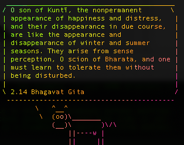

# BG\_108
108 most importan verses from Bhagavat Gita [according to](https://prabhupadagita.com/category/108-important-bhagavad-gita-slokas/), content stored in `108_BG_sloka.txt` with slight manual modification for easier parsing.

generated by   
`.to_fotune > BG_108_fortune_v1.txt`   
`strfile -c % BG_108_fortune_v1.txt BG_108_fortune_v1.txt.dat` [from](https://askubuntu.com/questions/36523/creating-a-fortunes-file)

**Usage**   
1. copy `BG_108_fortune_v1.txt` and `BG_108_fortune_v1.txt.dat`    
2. call `fortune BG_108_fortune_v1.txt `

**Example**  
`fortune ~/my_fortune | cowsay | lolcat -a -s 500`

**ChangeLog:**   
_v1   
18.68 an 18.69 grouped together, doe to meaning. 
